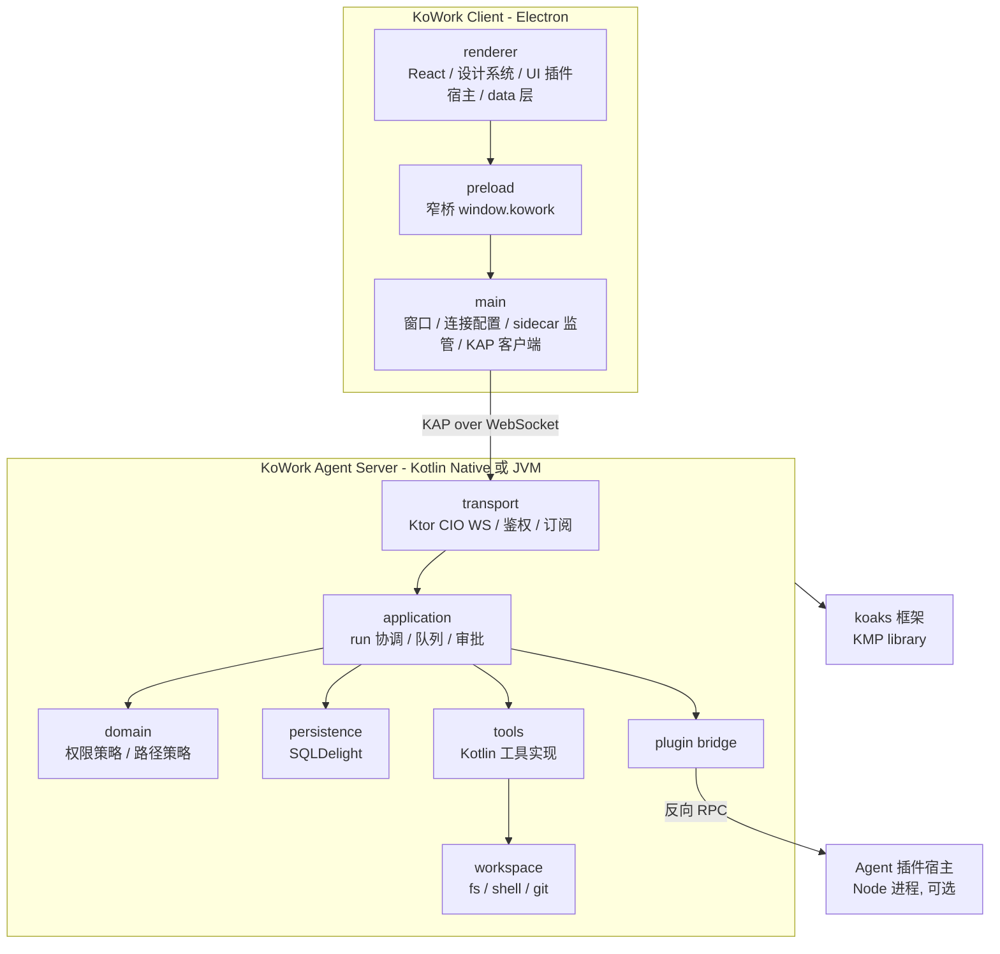

# KoWork 架构重构总计划

本文件是**跨会话的唯一共享上下文**。每个阶段会在独立会话中执行，那些会话没有本次讨论的上下文，因此每个任务都自带「背景 / 为什么这么做 / 范围 / 规范 / 验收」。执行任何任务前必须先完整读本文件。

---

## 一、已确认的四个根本决策

这四个决策决定了整份计划的形状，后续会话不得擅自更改。

- **决策 1：一套 Kotlin 实现，local 与 remote 完全同构。**
  9 个工具（`list_files` / `glob_files` / `read_file` / `search_files` / `edit_file` / `write_file` / `run_command` / `git_status` / `git_diff`）、持久化、审批、权限策略全部用 Kotlin 重写，产出自包含的 Kotlin/Native 可执行文件。本地模式由 Electron 以 sidecar 方式拉起**同一个二进制**，远程模式在服务器上部署**同一个二进制**。
  *原因：* 用户要求「工具调用完全在服务器上进行」。工具代码必须和工作目录同侧。若保留 TS 与 Kotlin 两套工具实现，权限策略、路径规范化、审批语义会长期漂移，这是最大的技术债来源。同构还意味着本地模式天然是远程模式的测试床。
- **决策 2：Server 拥有全部 Agent 状态；客户端只保留设备级偏好。**
  项目、会话、队列、run、事件、审批、供应商、API Key 全部归 server。客户端只存主题、背景图、面板宽度、语言、连接配置。API Key 加密存在 server 侧，由 server 调用 LLM。
  *原因：* 工作目录在 server，工具在 server 执行，历史必须与之同侧才能保证一致性；也让「换一台电脑接同一个服务器能看到全部历史」成立。Agent 在 server 跑就必须由 server 持有模型凭据，否则每次 run 都要下发密钥。
- **决策 3：双侧插件宿主。**
  插件 manifest 声明两半能力：UI 半（JS，跑在 renderer）+ Agent 半（JS，跑在紧邻 agent server 的独立插件宿主进程），Agent 半通过反向 RPC 接入 Koaks 的四个 hook 与自定义工具。
  *原因：* UI 卡片必须在 renderer 才能用 React 与设计系统；hook 必须紧邻 agent 才不引入每步网络往返，且远程模式下客户端离线时 run 仍能继续。
- **决策 4：硬切换，不写 TS→协议 适配层。**
  Kotlin server 开发期间，Electron 继续跑现有 TS core（完全不动）；达到功能对等后一次性换接并整体删除 TS core。
  *原因：* 用户明确选择总工时最小。适配层是纯抛弃代码。代价是阶段 4 期间应用短暂不可用——这是可接受的，因为阶段 3 期间旧代码一直可用。

**由决策 1 + 4 推导出的重要结论：不要投入工时重构现有 TS core 的内部结构。** `packages/core/src/infrastructure/db/database.ts`（901 行 god object）、`application/core-application.ts` 的 33 分支 switch、`tools/`、`infrastructure/{workspace,shell,git,koaks}/` 全部会被删除。对它们做拆分重构是浪费。技术债清理的对象是**会保留下来的部分**：renderer、preload、Electron main、契约层。

---

## 二、目标架构

连接形态：

- **本地模式**：Electron main 在随机 loopback 端口拉起随包分发的 sidecar 二进制，用一次性 token 鉴权，客户端连 `ws://127.0.0.1:<port>`。
- **远程模式**：用户在服务器上运行同一个二进制，首次启动生成并打印密钥；用户在 KoWork 设置里填 host / port / 密钥，密钥用 Electron `safeStorage` 加密存本地。

**安全约束（必须写进部署文档）**：Ktor 在 Kotlin/Native 上**不支持不经反向代理的 HTTPS**。因此远程部署规范是「二进制只监听 loopback 或内网，由 nginx / Caddy 终止 TLS」。客户端对非 loopback 地址**默认强制 `wss://`**，只有显式勾选「允许不安全连接」才放行 `ws://`，且 UI 必须持续显示告警。

---

## 三、目录与模块划分

### 3.1 `agent/` — 新增的 Kotlin 子项目（KoWork Agent Server）

放在 kowork 仓库内的独立 Gradle 构建，`koaks` 保持纯框架，通过 `includeBuild` 或已发布制品依赖。

- `agent/settings.gradle.kts` — 独立 Gradle 构建根，声明下列模块并 include koaks
- `agent/build-logic/` — convention plugin：KMP targets、toolchain、serialization。目标集：`linuxX64` `linuxArm64` `macosArm64` `macosX64` `mingwX64` + `jvm`（jvm 仅用于跑测试与本地调试，不分发）
- `agent/protocol/` — **KAP 线协议的唯一真源**。`@Serializable` 的请求 / 响应 / 事件 / 错误类型，方法名常量，协议版本。commonMain only，零 IO 依赖
- `agent/domain/` — 纯领域：权限模式语义、路径策略（canonicalize + symlink 真实路径校验 + 项目内外判定）、压缩策略、ID、领域错误。零 IO，全部可单测
- `agent/persistence/` — SQLDelight `.sq` 定义、迁移、repositories。按聚合分文件（projects / threads / queue / runs / events / approvals / grants / turns / compression / providers / models / settings / **plugins**），禁止再出现单个 god object
- `agent/workspace/` — 平台 IO 落地：`FileSystemPort`（okio）、`ProcessPort`（kmp-process）、`GitPort`（走 ProcessPort）。glob / 递归搜索 / 编码探测在此
- `agent/tools/` — 9 个内置工具的 Kotlin 实现 + `ToolRegistry`。每个工具一个文件，声明 schema、能力、锁模式、deadline、输出上限
- `agent/application/` — run 协调（每会话 FIFO、取消、中断恢复）、审批服务、供应商服务、标题生成、记忆压缩、Koaks agent 装配与缓存
- `agent/plugins/` — Agent 插件桥：`PluginBridgeHook`（实现 koaks `Hook` 的稳定转发器）、`PluginToolSource`（实现 koaks `LazyToolSource`）、插件宿主进程监管与反向 RPC
- `agent/server/` — Ktor CIO `embeddedServer`、WS 端点、鉴权、连接与订阅管理、事件 fan-out、游标补发
- `agent/app/` — `main()` 入口、CLI 参数、配置文件、密钥生成、日志。产出 native executable 与 jvm 可执行 jar

### 3.2 `packages/` — TS 侧共享包

- `packages/protocol/` — **取代现有 `packages/contracts`**。KAP 的 TS 镜像：Zod schema + 类型 + 方法名常量。与 `agent/protocol` 通过共享 JSON fixture 做一致性校验
- `packages/agent-client/` — KAP WebSocket 客户端（Node 侧，供 Electron main 使用）：连接、重连退避、请求关联、事件游标、鉴权握手
- `packages/design-system/` — 主题 token、动画原语、基础组件。**同时是插件 UI 的公开 API**，因此从第一天起就要版本化
- `packages/plugin-sdk/` — 插件开发 SDK：manifest 类型、`definePlugin`、UI 侧 context 类型、Agent 侧 hook / tool 类型、本地开发脚手架

`packages/core/` 在阶段 4 结束时**整体删除**。

### 3.3 `src/` — Electron 客户端

- `src/main/` — 窗口与 vibrancy、导航限制、系统通知、原生目录选择（仅本地模式）、连接配置持久化、`safeStorage` 密钥、sidecar 进程监管、KAP 客户端持有者、客户端本地设置文件（主题 / 背景图 / 面板宽度 / 语言）
- `src/preload/` — 窄桥。新增 `clientSettings`、`connection`、`plugins` 三个命名空间
- `src/renderer/src/`
  - `app/` — providers、ThemeProvider、应用外壳
  - `shell/` — 三栏布局骨架、状态栏、面板尺寸
  - `data/` — **唯一的协议访问层**。所有 query / mutation / 事件订阅集中在此，组件不得直接触碰 `window.kowork`
  - `features/projects/` — 项目与会话列表
  - `features/chat/` — timeline 与 composer
  - `features/approvals/` — 审批
  - `features/inspector/` — 右侧栏容器 + **卡片注册表**
  - `features/settings/appearance/` — 主题、背景图、模糊度、透明度
  - `features/settings/connection/` — 本地 / 远程、host / port / 密钥、连接状态
  - `features/settings/providers/` — 供应商与模型
  - `features/settings/plugins/` — 插件管理
  - `plugins/` — UI 插件运行时：发现、加载、surface 注册、热加载、能力注入
  - `shared/` — i18n、store、应用专属小组件

### 3.4 `docs/`

- `docs/architecture.md` — 重写。现有版本已过期（写协议 v3，实际代码是 v5；写 renderer 不依赖 Koaks，实际 `timeline-model.ts` 直接 import 了 `@koaks/node`）
- `docs/protocol/kap-v1.md` — 协议规范
- `docs/plugins/` — 插件开发指南与 API 参考
- `docs/deployment/` — 远程部署与 TLS 反向代理规范
- `docs/refactor/` — 本计划拆分出的分阶段任务说明书

---

## 四、贯穿全程的规范

视觉实现的目录边界、token、动画、选中态和插件 UI 规则集中维护在
[`docs/design-system.md`](design-system.md)。后续阶段新增界面时，先按该规范判断能力应进入
`packages/design-system` 还是 renderer 业务目录。

后续所有会话必须遵守：

- **协议单一真源**：任何新能力先在 `agent/protocol` 定义，再镜像到 `packages/protocol`，再实现。禁止在 renderer 或 main 里内联协议结构。
- **禁止 Koaks 类型外泄到客户端**：`AgentEvent` / `ModelEvent` 等框架类型不得出现在 KAP 或任何 TS 代码里。所有事件 payload 必须是协议自有的、带完整 schema 的 DTO。这是当前架构已被破坏的边界，重构必须修复。
- **样式零硬编码**：颜色、圆角、时长、缓动一律走 CSS 变量或设计系统 token。禁止新增 `#f3f3f3` 这类字面量。
- **动画只有两种**：进出用 `Reveal`（模糊淡入淡出），展开收起用 `Disclosure`（高度 + 模糊 + 位移）。禁止在业务组件里手写 keyframe 或 transition。
- **选中与悬停只有一种实现**：`SelectableList`。禁止再出现第二套选中视觉。
- **中文注释与文档**，代码标识符英文。
- **每阶段结束必须通过** `npm run typecheck`、`npm run lint`、`npm test`；Kotlin 侧通过 `./gradlew build`。

---

## 五、分阶段任务

### 阶段 0 — 架构基线与 KAP v1 协议定义

**背景**：当前契约层是 `packages/contracts`，33 条 RPC 用一张 `rpcSchemas as const` 表加 `CoreApplication.dispatch` 的 33 分支 switch 实现，协议版本是硬 `z.literal(5)`，不匹配直接 parse 失败、无协商能力。事件 payload 是 `z.record(z.string(), z.unknown())`，完全不约束，导致 Koaks 结构一路泄漏到 renderer。传输层只有 Electron `utilityProcess` 的 `parentPort` 适配器，没有任何网络能力。

**为什么先做这个**：协议是本次重构的枢轴。Kotlin server、TS 客户端、插件系统三方都实现它。协议里必须**现在就预留**后面几个阶段要用的命名空间，否则后期加会引发全链路改动。

**范围**：

- 撰写 `docs/protocol/kap-v1.md`：传输（WebSocket 单连接双向）、帧格式、鉴权握手、版本协商（改为 `min/max` 区间协商，不再是字面量相等）、请求关联、事件游标与断线补发、错误码表。
- 在 `agent/protocol` 写 `@Serializable` 类型（此阶段可先只建 Gradle 骨架 + 类型，不实现服务端）。
- 在 `packages/protocol` 写 Zod 镜像。
- 建立 `conformance/` 共享 JSON fixture 目录，双侧测试各自解析同一批 fixture，保证线格式一致。
- 迁移现有 33 条 RPC 与 21 种事件到 KAP，并**补齐每种事件 payload 的完整 schema**（当前 `run.`* 事件 payload 无约束，必须逐个定义）。删除 schema 里从未被 publish 的死枚举 `core.recovered`。
- **预留但可暂不实现的协议面**（必须在 v1 里就定义，标注 `unimplemented`）：
  - `server.info` — server 版本、平台、能力位、协议区间
  - `auth.*` — 握手与密钥轮换
  - `fs.browse` — **服务端目录浏览**。远程模式下不能用 Electron 原生对话框选工作目录，这是必须的新能力
  - `files.upload` — 客户端上传文件到服务端工作目录
  - `plugins.list` / `install` / `enable` / `disable` / `uninstall` / `reload`
  - `plugin.*` 事件族，事件信封增加可选 `pluginId`
  - `settings.*` 明确只承载 **ServerSettings**（默认模型 profile、默认权限模式、工具预算）。ClientSettings（主题、背景、面板宽度、语言、连接配置）**不进协议**
- 撰写 `docs/architecture.md` 新版与决策记录（把本文第一节的四个决策落档）。

**验收**：协议文档完整；双侧类型编译通过；conformance fixture 双侧测试全绿；`docs/architecture.md` 与代码一致。

**不做**：不改任何运行时行为，不动现有 `packages/contracts` 的使用方（阶段 4 才切）。

---

### 阶段 1 — 设计系统与动画统一

**背景（现状调查结论）**：renderer 共 32 文件 5269 行，样式已明显发散：

- 圆角 6 种混用，56 处：`rounded-md` 29 次、`rounded-xl` 7 次、`rounded-lg` 6 次、`rounded` 5 次、`rounded-2xl` 4 次、`rounded-[4px]` 2 次
- 悬停至少 5 套：token 填充、直接 `bg-neutral-50/100/200`、只改文字、改边框、伪元素
- 选中至少 4 套：`SelectionList` 滑动 pill、`item-fill` 就地填充、Inspector tab 的 `bg-neutral-200/60`、权限 segmented 的蓝底
- 硬编码色值散落：`#262626` `#dddddd` `#f5f5f5` `#f3f3f3` `#f7f7f6` `rgb(229 229 229 / 0.7)`
- focus 环 3 套；退出动画时长常量 220ms 在 3 个文件各写一遍
- 左侧栏项目行用了 `kowork-select-item` 但没有 `data-selected`，所以**当前项目根本没有背景高亮**，只有会话有——这是最明显的交互不一致

已有的好基础：动画曲线几乎统一为 `cubic-bezier(0.22, 1, 0.36, 1)`；选中 / 悬停已有 `--kowork-select-active` / `--kowork-select-hover` 两个变量；`SelectionList` 已把滑动轨与 item 悬停拆开；`prefers-reduced-motion` 已集中处理。

**为什么在 Kotlin 服务端之前做**：这一阶段与协议、与数据层**完全无关**，不存在被阶段 4 返工的风险；而插件 UI API 必须建立在设计系统之上（插件不能硬编码颜色圆角，只能消费 token 与原语），所以设计系统必须先冻结。此外阶段 4 要新建连接设置等界面，有了组件词汇表会更快。

**范围**：

- 新建 `packages/design-system`，把 `src/renderer/src/assets/main.css`（627 行）拆分：动画 keyframes 与 token 进设计系统，应用专属样式留在 renderer。
- **统一圆角为 4 级语义 scale**，并把 56 处逐一映射：
  - `sm` 6px — badge、进度条、tag、tooltip
  - `md` 8px — 按钮、输入、列表行、菜单项
  - `lg` 12px — 卡片、面板、菜单容器、下拉
  - `xl` 16px — 对话框、composer 外壳、消息气泡
    用 Tailwind v4 的 `@theme inline { --radius-md: var(--kw-radius-md); }` 模式，使 `rounded-md` 等工具类直接输出 `var(--kw-radius-md)`，从而支持运行时主题覆盖。
- **动画抽成两个公共原语**（用户明确要求）：
  - `Reveal` — 由现有 `BlurReveal` 提升。规范：**所有**页面 / pane 切换、卡片弹出、菜单、下拉、对话框、审批条、会话切换都用它。把散落的 220ms 退出常量收进设计系统单一来源
  - `Disclosure` — 由现有 `AnimatedDisclosure` 提升。规范：**所有**展开收起都用它（左侧栏项目会话、timeline 的思考与工具内容、设置分组、Inspector 卡片折叠）
  - 附带迁移 `SwapText`（原 `BlurSwapText`）、`OrbitSquares`、`StreamEnter`
- **统一选中与悬停为单一实现** `SelectableList` + `SelectableItem`，视觉基准就是左侧栏会话列表（滑动 pill + `--kw-hover` 悬停填充）。改造范围：Provider 列表、Inspector tab、设置左侧 nav、权限 segmented、ContextMenu 菜单项、**并修复项目行缺失的选中高亮**。
- 新增 `Surface` 原语统一卡片 / 面板容器（radius + border + 背景），Inspector 三张卡片、设置卡片、审批卡全部改用。
- 统一 focus 环为单一 token；统一主按钮与次按钮。
- 建立 **Inspector 卡片注册表**（`features/inspector/registry.ts`），把现在硬编码在 `InspectorPanel.tsx`（292 行）里的三张卡片改为注册表项。**这是阶段 5 的关键预留**：插件届时只是往同一个注册表注册外部来源，不需要再改 Inspector。
- 从第一天起导出 `PluginUiKit`（设计系统的稳定公开子集）并标注 API 版本。

**验收**：全仓库 grep 不到硬编码颜色与非 token 圆角；只存在两种动画原语；只存在一套选中 / 悬停实现；Inspector 卡片来自注册表；视觉回归通过（建议补 Playwright 截图基线）。

**不做**：不引入新的视觉风格，不做暗色模式（留给阶段 2 的主题体系）。

**实施结果（2026-08-18）**：阶段 1 已落地。实际实现与后续维护入口如下：

- 新建 `packages/design-system/`，公开 `Reveal`、`Disclosure`、`SelectableList`、`SelectableItem`、`Surface`、`Button`、`IconButton`、`ContextMenu`、`SwapText`、`OrbitSquares`，并通过 `PluginUiKit` 固定插件 API v1。
- 将 token、motion、primitives、content 拆到 `packages/design-system/src/styles/`；renderer 的 `main.css` 只保留窗口、布局、拖拽、面板 resizing、业务间距和滚动条几何。
- 删除 renderer 中旧的 `BlurReveal`、`AnimatedDisclosure`、`BlurSwapText`、`SelectionList`、`IconButton`、自绘 `ContextMenu`、`OrbitSquares` 实现，避免兼容层和第二套视觉实现。
- Inspector 已迁移到 `src/renderer/src/features/inspector/`，三张内置卡片通过 `registry.ts` 注册；后续插件卡片应复用该 registry，不得重新修改 `InspectorPanel` 的固定 JSX。
- 补充 `docs/design-system.md` 作为日常开发规范，明确 token、目录边界、插件 API 和新增视觉需求流程。

验证结果：`pnpm typecheck`、`pnpm test`（233 项）、`pnpm build`、阶段 1 范围 eslint、`git diff --check` 通过；全仓 `pnpm lint` 仍受仓库已有生成文件、既有 lint 错误和 Prettier warning 影响，未发现阶段 1 新增错误。最后一次代码修正后的完整 Electron e2e 未能重新执行，原因是沙箱外 Electron 启动审批服务返回 503，因此不能将全量 e2e 标记为通过。

---

### 阶段 2 — 主题体系

**实施前背景**：阶段 2 开始前没有主题概念。`app_settings` 是 KV 表但 `appSettingsSchema` 不允许未知字段，多余 key 不会 round-trip，所以主题**不能**塞进现有设置。窗口当时已支持透明与 `vibrancy` / `mica`，`[data-frosted]` 会把选中 / 悬停 token 换成半透明黑——这是主题机制的雏形，需要吸收进正式设计。

**为什么紧接阶段 1**：主题就是「给设计系统 token 换值」。阶段 1 把所有强调色、悬停色、圆角收敛成 token 之后，主题几乎是免费的——这正好回答了「设计统一能否用主题实现」：**是的，统一 token 是前提，主题是它的自然结果**。

**范围**：

- 主题模型：`accent`（预置 ID 或小写 `#rrggbb`，推导选中 / 悬停 / 强调前景）、`surface`、`border`、`text` 若干层级，以及可选 `background`（`<uuid>.<ext>` 资源 ID、`blurPx` 0–64、`surfaceOpacity` 0.45–0.95）。本阶段不提供 `radiusScale` UI。
- 内置主题：默认灰（严格等于阶段 1 收敛后的现有观感，作为基准不得漂移）+ 若干预置强调色。
- 用户自定义强调色（取色器），以及自选背景图片 + 模糊度滑杆 + 透明度滑杆。
- **存储位置：客户端本地**（决策 2）。落在 Electron `userData/client-settings.json`，经 main 读写，preload 暴露 `clientSettings` 命名空间。背景图片复制进 `userData/backgrounds/<uuid>.<ext>`，扩展名仅允许 `png/jpeg/webp/gif`，renderer 只使用 `kowork-bg://` 协议 URL；`index.html` 的 CSP 放行该 scheme。
- 旧 `localStorage` 的三个面板宽度只通过 preload 的一次性 bootstrap handshake 迁移；写入成功后才删除旧键，非法旧值使用对应默认值并记录结构化 warning。Composer 与 dialog/popover/menu/tooltip 归入不透明 raised 层。
- 主题切换必须只改 CSS 变量，不触发 React 重渲染整棵树；切换本身走 `Reveal`。
- 背景图层与现有 `vibrancy` / `mica` / `frosted` 的叠加关系要明确定义，避免两套毛玻璃互相打架。
- `features/settings/appearance/` 界面。

**验收**：切换主题 / 强调色 / 背景图 / 模糊度 / 透明度全部即时生效且覆盖全应用（含 Inspector、对话框、菜单、timeline）；重启后保持；默认灰主题与阶段 1 结束时的观感逐像素一致。

**实施结果（2026-08-19）**：阶段 2 已完成。

- 新增 `@kowork/client-settings`、原子持久化、一次性 layout 迁移、独立 preload/IPC、壁纸文件校验与 `kowork-bg://` 协议，并同步 `nativeTheme` 与窗口背景。
- design-system 已提供 light/dark palette、默认灰与六种彩色强调色、自定义强调色推导、chrome/raised 图层、`Slider` 和无 React 的 theme runtime；`PluginUiKit` v1 集合不变。
- renderer 已接入 AppearanceRoot、设置外观页、全窗壁纸、三栏 chrome 和 raised Composer。主题切换不 remount App，连续快速修改壁纸参数采用乐观 patch 序列，避免旧广播覆盖最新值。
- 后续视觉回归已统一左侧栏与会话/Inspector 顶栏的半透明模糊，去掉顶栏点阵；壁纸铺满全窗且不受全局 `img` 最大宽度限制；Composer 下方遮挡改为滚动区 mask，不再绘制半透明色块。
- Inspector 默认展开，确保工作区首次进入即可看到状态信息和上下文卡片；用户仍可通过会话顶栏按钮收起或重新展开。
- Fake Agent 的工具调用 delta 使用独立 provider ID，并通过 `itemRef` 与 finalized call、tool result 的 canonical call ID 对齐；完整 Electron 流程确认 Timeline 不再产生重复工具活动。E2E 对 hover 过渡和默认展开 Inspector 的断言已同步到当前产品行为。

最终验证结果：`pnpm test`（280 项）、`pnpm build`（含 typecheck）、`pnpm lint`、`git diff --check` 和完整 `pnpm exec playwright test`（5 项）通过。`pnpm lint` 无错误，仍报告 337 条既有 Prettier warning；本阶段未通过批量格式化扩大修改范围。

---

### 阶段 3 — Kotlin Agent Server 到功能对等

**背景**：这是最大的一块。现有能力全在 TS：`AppDatabase` 901 行覆盖 12 张表；`FileService` 373 行走 `node:fs/promises`；`CommandRunner` 203 行 `spawn` 本机 shell；`GitService` 178 行 `spawn git`；`ToolRegistry` 279 行做 schema / 授权 / 锁 / deadline / 输出裁剪；`KoaksAgentRuntime` 404 行装配 Koaks Agent 并按 `(project, thread, profile, provider.updatedAt)` 缓存。全部要用 Kotlin 重写。

**期间应用状态**：Electron 继续跑旧 TS core，**完全不动**。所以阶段 3 期间应用一直可用。

**前置 spike 实施结果（2026-08-19）**：`agent/spike` 已完成 macOS Arm Native 纵切回归门。
release binary 的 `self-test` 在 loopback Ktor CIO WebSocket 上完成 `hello/welcome`、
`runs.enqueue`、一次 Koaks scripted model 的 `read_file` 和 KAP 事件回传，并实际执行
kmp-process `/usr/bin/printf` 探针、SQLDelight Native 内存表的写入读回和 `interop:json` 公共
wire codec。该模块只实现 KAP 子集，长期保留用于回归；不引入正式 persistence schema、队列、
审批、Provider、插件、远程 bind 或 Linux target。

**已验证的技术前提**（不要重新调研）：

- Ktor CIO `embeddedServer` 支持 Kotlin/Native 且支持 WebSocket。限制：只能用 CIO 引擎；**不支持无反向代理的 HTTPS**
- `kmp-process`（`io.matthewnelson.kmp.process`）支持 Native linux / macOS / mingw 的 `posix_spawn`、`stdoutFeed` / `stderrFeed` 流式输出、`destroySignal`。满足 `run_command` 的流式与进程组终止需求
- SQLDelight `native-driver`（底层 SQLiter）支持 `linuxX64`。注意需正确链接系统 sqlite3，且为 glibc 兼容性建议在较旧的 Linux 上构建发布产物
- koaks 现有 KMP 目标已含 `jvm` / `js` / `macosArm64` / `mingwX64` / `iosArm64` / `iosSimulatorArm64`，**Native 不是从零开始**；缺的是 Linux
- koaks 的 `okio` 依赖已是 Native 兼容，可用于文件 IO

按子阶段拆分为独立会话：

#### 3a — koaks 框架侧改造（改动 `/Users/atri/DevLab/Kotlin/koaks`）

已完成的公共 codec 范围：

- 新增独立的 `interop:json` KMP 模块，使用 commonMain 的 `@Serializable` wire DTO 与显式 mapper。
- 将 Node bridge 的领域对象 JSON 映射迁移到公共 `KoaksWireJson` facade；Node 侧不再维护第二套事件 wire 实现。
- 保留现有 Node JSON 字段形状、snake_case、discriminator、opaque/base64 payload、nullable/default 语义和 `AgentError.cause.message` 限制。
- common codec 测试覆盖模型事件、Agent 事件、运行时 envelope、状态嵌套类型、golden fixture 和 fail-fast 解析错误。

暂缓的 Linux / 额外 Native 范围：

- `linuxX64()` / `linuxArm64()` 目标，以及 `macosX64()` 评估。
- Linux HTTP client engine actual、FileSystem 与 PlatformType actual；相关 `ktor-client-cio` 选型仍留待后续 Native 纵切验证。
- JVM-only 的 `@Tool` 反射 / Jackson / victools 路径不进入 Native；Native 侧仍统一使用 commonMain 的 `tool<In>()` 与 `Tool<In>` 接口。

**阶段 3a 当前实施结果（2026-08-19）**：公共事件 wire codec 子范围已完成，但阶段 3a 不整体结项；Linux 与额外 Native target 仍是后续工作。Koaks 的 macOS Native、JS Node 和 JVM 相关测试已验证通过。

**剩余验收**：恢复 Linux 范围后，需在 Linux 与 macOS 上完成构建，并让 Linux Native target 编出可执行的最小示例并成功调一次模型。

#### 3b — `agent/` Gradle 骨架 + persistence

- 建立 `agent/` 独立 Gradle 构建、build-logic、目标集，依赖 koaks
- SQLDelight schema 落地 12 张表，**并从一开始就加 `plugins` 与 `plugin_state` 两张表**（阶段 5 的预留；早加便宜、晚加要写迁移）
- 按聚合拆 repositories，禁止重现 god object
- 迁移文件可审阅（对应现有 `packages/core/drizzle/` 的规范）

#### 3c — workspace 层（fs / shell / git）

- `FileSystemPort` 基于 okio：读写、目录列举、递归遍历、glob、内容搜索、编码探测、原子写
- `ProcessPort` 基于 kmp-process：流式 stdout / stderr、超时、取消、先终止进程组再强杀
- `GitPort` 走 ProcessPort 调 `git -C <root>`，只做只读的 status / diff / summary
- 严格移植现有安全语义：路径先 canonicalize、检查 symlink 解析后的真实路径、启动子进程前剔除名称匹配密钥 / 令牌 / secret / password 模式的环境变量

#### 3d — tools 层

- 9 个工具逐个移植，保持 `defineTool` 的等价形状：Kotlin 序列化 schema、`hasSideEffects`、`fileAccess`、`shellAccess`、`lockMode`、`timeoutMs`、`maxOutputChars`
- 保持现有约束：最终结果上限 64,000 字符并明确返回截断信息；shell 流式事件每次调用最多持久化 256,000 字符；项目读工具共享锁，edit / write / shell 独占锁
- `prepare()` 必须声明访问意图，未声明的访问默认拒绝——这条策略要完整移植

#### 3e — application 层

- run 协调：每会话 SQLite 持久化 FIFO、不同会话并发、入队冻结模型与上下文窗口配置、权限模式每次工具调用时读会话当前值
- 失败 / 取消 / 中断 / 压缩失败暂停该会话队列；启动时把活动 run 标为 `interrupted` 且不自动重放有副作用的工具调用
- 审批服务：ask / auto / yolo 三档，run 级路径授权区分 read / write，目录授权覆盖子路径，授权仅在当前 run 内有效
- 记忆：实现 koaks `ThreadMemory`，持久化完整历史与 provider checkpoint；达到 profile 限额 90% 时先生成持久化 system summary 再继续原请求；压缩最多保留最近 8 个完整 turn 并按预算动态降到至少 1 个
- 供应商与凭据：密钥加密存 server 侧（不再依赖 Electron `safeStorage`，需自带加密方案与主密钥派生），模型列表刷新的 HTTP 调用抽成 `ProviderPort`（不要像现在这样把 `fetch` 写在应用层）
- Koaks agent 缓存 key 要**预留 `pluginVersion` 维度**（阶段 5 需要）

#### 3f — server 层（transport + 鉴权）

- Ktor CIO `embeddedServer` + WS 端点，实现 KAP v1
- 鉴权：bearer token 握手；首次启动生成密钥并打印 + 落配置文件；支持轮换
- 连接管理：多客户端并发订阅、按事件游标补发、慢订阅者不得阻塞 run 循环（**修复现有 `CoreEventBus` 同步广播的隐患**）
- `fs.browse`（服务端目录浏览）与 `files.upload` 在此实现
- CLI：`--port` `--bind` `--data-dir` `--print-key` `--rotate-key`

**阶段 3 整体验收**：一份对等性检查清单逐条打勾（33 条 RPC + 21 种事件 + 三档权限矩阵 + 9 个工具行为）；Kotlin 侧集成测试覆盖 SQLite、run、审批、恢复；能用 `websocat` 之类工具手工跑完一次完整会话。

---

### 阶段 4 — 客户端换接 KAP 并删除 TS core

**背景**：这是硬切换阶段，期间应用不可用。现状要拆的耦合点：`src/main/core/core-supervisor.ts`（221 行）强绑 Electron `utilityProcess`；`src/preload/api.ts`（84 行）里 `providers.create/update/archive` 走独立 IPC 通道只为了不让 API Key 进 Core RPC——server 侧持有凭据后这条特殊通道可以取消；`projects.add` 走 Electron 原生对话框，远程模式必须改走 `fs.browse`；`src/renderer/src/features/chat/timeline-model.ts` 直接 import 了 `@koaks/node` 的 `Annotation` / `ModelEvent`，必须改用协议 DTO。

**范围**：

- 实现 `packages/agent-client`：WS 连接、重连退避、请求关联、事件游标、鉴权
- `src/main` 增加 sidecar 监管（本地模式拉起随包二进制、随机 loopback 端口、一次性 token）与连接配置管理（远程 host / port / 密钥，`safeStorage` 加密）
- 建立 `src/renderer/src/data/` 作为唯一协议访问层，把组件里所有 `window.kowork.*` 调用收拢进去
- 移除 renderer 对 `@koaks/node` 的依赖，事件消费改为协议 DTO
- `features/settings/connection/`：本地 / 远程切换、连接状态、密钥录入、不安全连接告警
- 项目选择在远程模式改用 `fs.browse`；补 `files.upload` 的上传入口
- **删除** `packages/core/`、`src/core/`、`vendor/koaks/` 的 tgz 依赖、`@koaks/node` 依赖、`packages/contracts`（已被 `packages/protocol` 取代）、未被使用的 `chokidar` 依赖
- 打包：`electron-builder` 把 sidecar 二进制放进 `resources/bin/`，按平台分发；构建流程串上 Gradle native 产物
- 现有本地 SQLite 数据的一次性迁移工具（可选，若判断不值得就明确记录「不迁移」）

**验收**：本地模式与远程模式都能跑完整会话（含审批、取消、队列、压缩、git 面板）；`packages/core` 与 `@koaks/node` 在 kowork 仓库中不再存在；`npm run typecheck` / `lint` / `test` / `test:e2e` 全绿。

---

### 阶段 5 — 插件系统

**背景与已有抓手**：右侧栏 `InspectorPanel.tsx` 目前三张卡片全部硬编码、没有注册表、右上角 `Plus` 按钮是 disabled 的占位。Koaks 侧有两个对热加载极其关键的现成能力：

- `Hook` 是**接口**（`onModelRequest` / `onModelStream` / `onToolCall` / `onToolResult`），且 `Agent` 持有 `List<Hook>`。因此只要注册**一个稳定的转发器 Hook**、由它在调用时动态查当前插件表，插件热加载就**不需要重建 Agent**
- `ToolScope.source(source: LazyToolSource)` 是懒工具源，正好用于动态注册插件工具

四个 hook 点的确切语义（写进插件文档）：

- `onModelRequest(ctx): ModelRequest` — 可改写请求（items / instructions / tools / format）；**不能短路**；注意最后一步 `ModelCallPhase.StructuredFinalization` 通常应跳过
- `onModelStream(ctx, events): Flow<ModelEvent>` — 包装事件流，可变换 / 丢弃 / 改写；**禁止 collect**，只能用惰性算子；不能取消 HTTP
- `onToolCall(ctx): ToolDecision` — `Proceed` / `ProceedWith(改写后的 call)` / `Deny(reason)` 可短路（工具不执行）
- `onToolResult(ctx, outcome): ToolOutcome` — 可改写结果（如截断输出）；不能撤销已执行的工具

**范围**：

- 插件 manifest（`kowork.plugin.json`）：id、版本、`apiVersion`、`ui` 半（entry + surfaces）、`agent` 半（entry + hooks + tools）、`permissions`、可选 i18n bundle
- `packages/plugin-sdk`：`definePlugin`、UI context 类型、Agent 侧 hook / tool 类型、本地开发脚手架与热加载 watch
- **UI 插件宿主**（renderer）：发现、加载、surface 注册到阶段 1 建立的 Inspector 卡片注册表、能力注入、热加载（重新 import + 反注册再注册 + `Reveal` 重挂载）。插件只能通过注入的 `PluginUiKit` 拿到设计系统原语与主题 token，**不得硬编码颜色圆角**
- **信任模型（需明确记录）**：UI 插件在 renderer 同 realm 执行 + 能力受限的 context 对象 + 安装时显式授权确认；不做 iframe / worker 强隔离。理由是 React 卡片跨 realm 渲染成本过高，且这是用户主动安装的本地开发工具。强隔离列为后续加固项
- **Agent 插件宿主**：独立 Node 进程，由 agent server 监管（本地模式由 Electron 侧拉起，远程模式在服务器上运行）。Kotlin 侧 `PluginBridgeHook` + `PluginToolSource` 通过反向 RPC 转发。参考 koaks `interop:node` 已有的 `CallbackGateway` 模式（JS `invoke(id, json)` 返回 Promise，cancel 走 `notify`）
- **远程模式下插件宿主需要 Node**：这意味着「自包含二进制」在启用 Agent 插件时有一个可选的外部依赖。必须在部署文档里写清：无 Node 时 server 正常运行，仅 Agent 插件不可用
- 把 Inspector 现有三张卡片（状态信息、上下文窗口、会话指标）**改写为内置插件**，用以验证 API 表达力是否足够
- 插件管理 UI：列表、启用 / 禁用、安装 / 卸载、重载、权限查看、错误与日志
- 顺手修掉调查中发现的 bug：Inspector 上下文窗口徽章永远显示「上下文充足」，不看实际百分比

**验收**：能从零写一个同时贡献 Inspector 卡片和一个 `beforeToolCall` hook 的插件；改动插件源码后无需重启应用、无需重建 Agent 即生效；插件崩溃不影响主应用与 run；三张内置卡片以插件形式工作且外观与阶段 1 基准一致。

---

### 阶段 6 — 收尾与技术债清理

- 拆分阶段 1–5 中仍然过大的文件。当前超阈值清单：`Timeline.tsx` 608 行（渲染 + 流式打字 + 复制 + 多种 activity UI 混在一起）、`ProviderSettings.tsx` 561 行、`browser-preview.ts` 439 行、`ProjectSidebar.tsx` 366 行（布局 + 运行指示 + 双份 CRUD + 右键菜单 + 内嵌 SettingsDialog）
- `browser-preview.ts`（439 行的整套 mock `window.kowork`）改为对着 KAP 做 mock server，避免与真实协议漂移
- 测试矩阵：单元（协议与领域策略）、集成（持久化 / run / 审批 / 恢复）、e2e（Playwright 全链路，覆盖本地与远程两种连接）
- 文档定稿：架构、协议、插件开发、远程部署与 TLS 规范
- 分发：多平台 sidecar 二进制的构建与签名流程

---

## 六、风险登记

- **Kotlin/Native 无原生 HTTPS**。远程部署强制依赖反向代理。若不可接受，替代方案是在应用层做加密握手，成本显著更高。建议先按反向代理走。
- **SQLDelight Native 在 Linux 的链接与 glibc 兼容性**。需在较旧的 Linux 发行版上构建发布产物。这是阶段 3b 的第一个 spike。
- **Linux 的 ktor client engine 选型**（CIO vs curl）。阶段 3a 必须实测，不要凭文档假定。
- **阶段 3 工时体量**。工具 + 持久化 + 审批 + 服务端全量重写是本计划最大的不确定性。建议在 3b 之前先做一个纵切 spike：macOS Arm native 二进制里跑通「WS 连接 → 一次 `read_file` 工具调用 → 事件回传」，验证 Ktor server + kmp-process + SQLDelight + koaks 四者能在同一个 native 二进制里共存。这个 spike 的价值远高于其成本；Linux 运行验证留到后续范围。
- **阶段 4 期间应用不可用**。建议在切换前打 tag 并保留可运行的旧版分支。
- **插件同 realm 执行的安全性**。已作为显式取舍记录，需在 UI 安装流程里明确告知用户。
